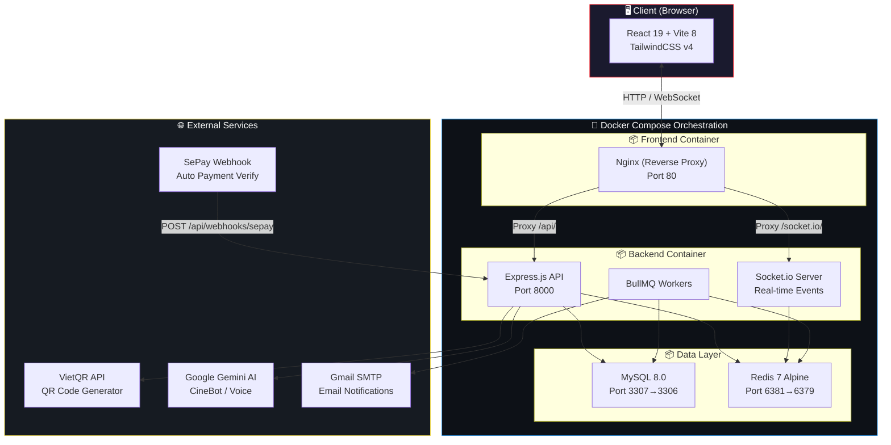
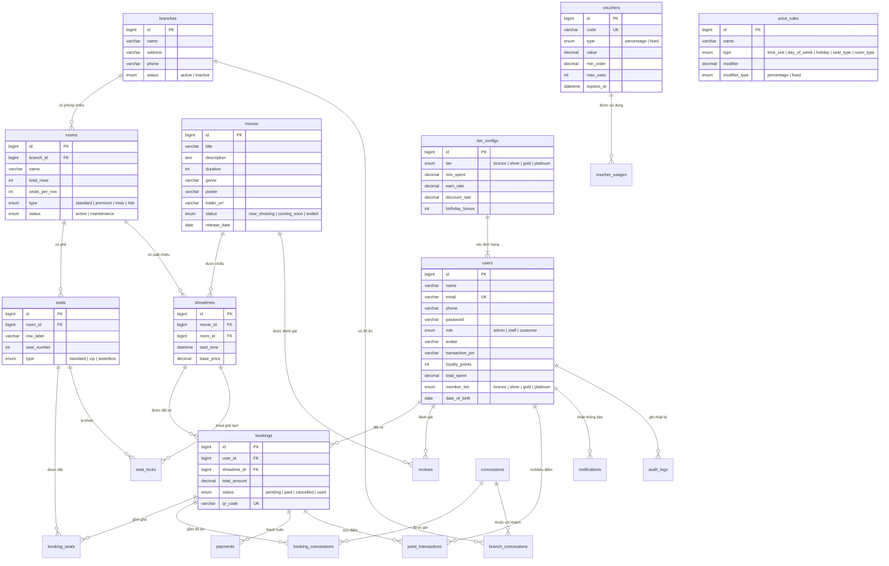
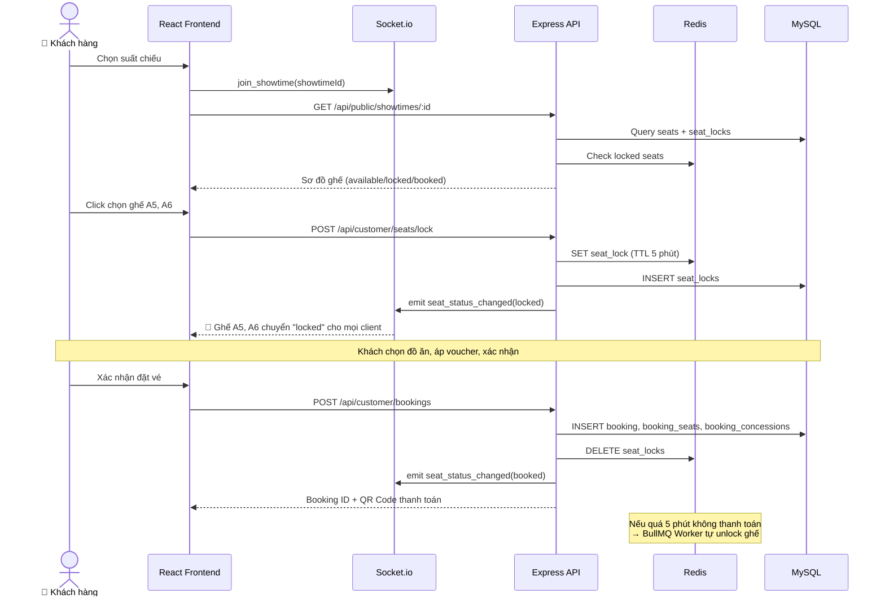
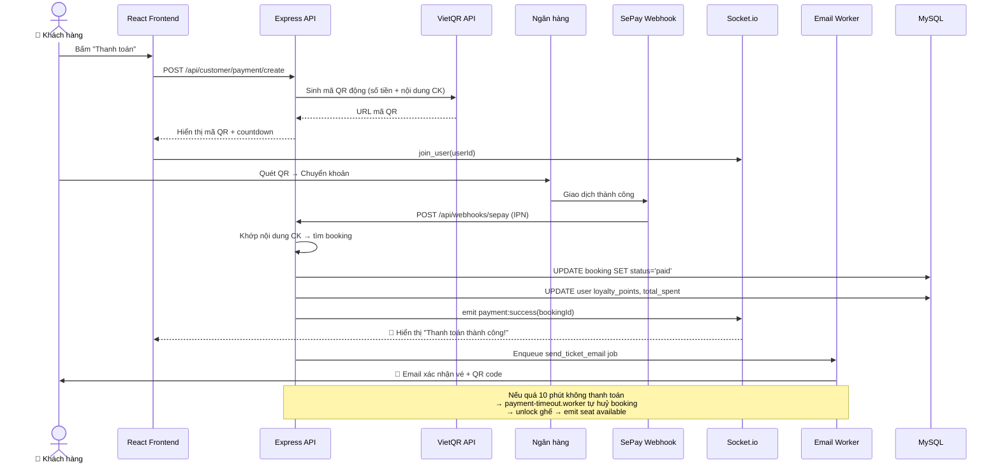
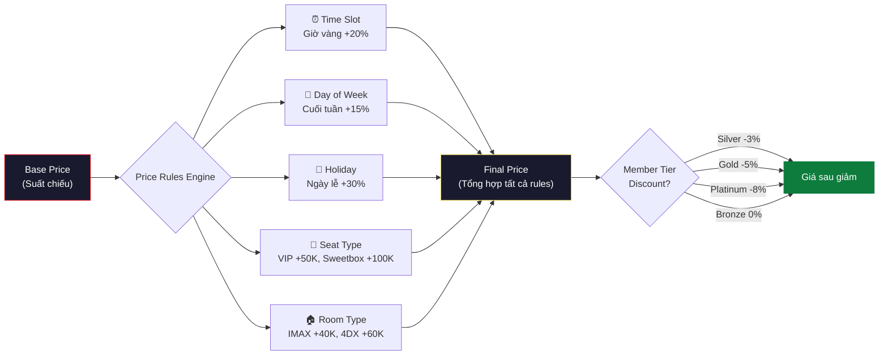
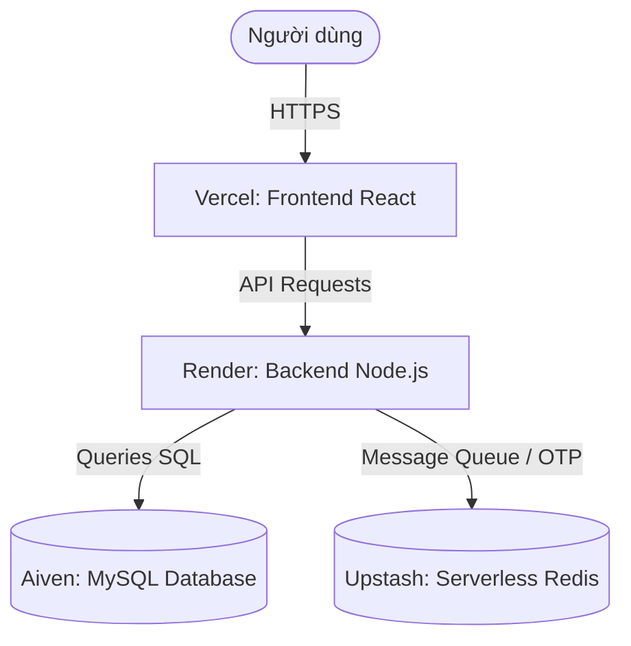

<p align="center">
  
</p>

<h1 align="center">🎬 Hệ thống Quản lý & Đặt vé Rạp chiếu phim Đa chi nhánh</h1>

<p align="center">
  <b>Multi-branch Cinema Management System</b>
</p>

<p align="center">
  
  
  
  
  
  
  
  
</p>

---

## 📋 Mục lục

- [Tổng quan dự án](#-tổng-quan-dự-án)
- [Kiến trúc hệ thống](#-kiến-trúc-hệ-thống)
- [Công nghệ sử dụng](#-công-nghệ-sử-dụng)
- [Tính năng chi tiết theo phân quyền](#-tính-năng-chi-tiết-theo-phân-quyền)
- [Cơ sở dữ liệu](#-cơ-sở-dữ-liệu)
- [Cấu trúc thư mục](#-cấu-trúc-thư-mục)
- [Hướng dẫn cài đặt & khởi chạy](#-hướng-dẫn-cài-đặt--khởi-chạy)
- [Biến môi trường](#-biến-môi-trường)
- [API Endpoints](#-api-endpoints)
- [Luồng nghiệp vụ cốt lõi](#-luồng-nghiệp-vụ-cốt-lõi)
- [Tài khoản Demo](#-tài-khoản-demo)
- [Triển khai Production (Cloud Deployment)](#-triển-khai-production-cloud-deployment)

---

## 🎯 Tổng quan dự án

**Cinema Management System** là một hệ thống quản lý rạp chiếu phim đa chi nhánh đầy đủ chức năng, được xây dựng theo kiến trúc **Client-Server** hiện đại. Hệ thống hỗ trợ **3 vai trò người dùng** (Khách hàng, Nhân viên, Quản trị viên) với các tính năng nổi bật:

- 🎟️ **Đặt vé trực tuyến thời gian thực** — Khoá ghế tức thời bằng Socket.io + Redis, chống trùng ghế tuyệt đối ngay cả khi hàng trăm người đặt cùng lúc.
- 💳 **Thanh toán tự động** — Tích hợp VietQR sinh mã QR động, SePay Webhook tự khớp giao dịch ngân hàng, tự chuyển trạng thái vé sang `paid` mà không cần thao tác thủ công.
- 🤖 **AI Chatbot (CineBot)** — Trợ lý ảo hỗ trợ tra cứu phim và đặt vé bằng giọng nói/text, sử dụng Google Gemini API.
- 💰 **Hệ thống giá động (Dynamic Pricing)** — Tự động điều chỉnh giá vé theo khung giờ, ngày lễ, loại ghế, loại phòng.
- ⭐ **Loyalty & Membership** — Hệ thống hạng thành viên (Bronze → Silver → Gold → Platinum) với tích điểm, ưu đãi sinh nhật và chiết khấu tự động.
- 🏬 **Quản lý đa chi nhánh** — Quản lý nhiều rạp chiếu phim trên cùng một hệ thống.

### Thiết kế giao diện

Giao diện người dùng được thiết kế theo phong cách **premium**, lấy cảm hứng từ các nền tảng giải trí hiện đại:

| Đặc điểm | Mô tả |
|-----------|-------|
| 🎨 **Glassmorphism** | Hiệu ứng kính mờ, backdrop-blur xuyên suốt layout |
| 🌙 **Dark Mode** | Tông màu tối sang trọng, phù hợp chủ đề rạp chiếu phim |
| 🎬 **Video Background** | Trang đăng nhập/đăng ký với video nền động sống động |
| 🎠 **Hero Slider** | Slider trailer phim mượt mà với Swiper.js |
| ✨ **Micro-animations** | Hiệu ứng hover, transition mượt tăng trải nghiệm người dùng |
| 📱 **Responsive** | Giao diện tương thích desktop, tablet và mobile |

---

## 🏗 Kiến trúc hệ thống



### Mô tả luồng hoạt động

1. **Client** (React SPA) gửi request qua **Nginx** (reverse proxy).
2. **Nginx** phân luồng: `/api/*` → Backend Express, `/socket.io/*` → Socket.io Server, `/uploads/*` → Static file server.
3. **Backend** xử lý business logic, truy vấn **MySQL** cho dữ liệu bền vững, sử dụng **Redis** cho seat locking, caching và message queue.
4. **BullMQ Workers** chạy background: gửi email xác nhận vé, tự động giải phóng ghế khi quá hạn thanh toán.
5. **External Services**: VietQR sinh mã QR thanh toán, SePay webhook xác nhận giao dịch tự động, Gemini AI xử lý chatbot.

---

## 🛠 Công nghệ sử dụng

### Frontend

| Công nghệ | Phiên bản | Vai trò |
|-----------|-----------|---------|
| **React** | 19.2 | Thư viện UI, component-based architecture |
| **Vite** | 8.0 | Build tool, HMR (Hot Module Replacement) siêu nhanh |
| **Tailwind CSS** | 4.2 | Utility-first CSS framework |
| **React Router DOM** | 7.13 | Client-side routing (SPA) |
| **Axios** | 1.13 | HTTP Client giao tiếp API |
| **Socket.io Client** | 4.8 | WebSocket client cho real-time events |
| **Swiper** | 12.1 | Slider/Carousel component cho trailer phim |
| **Recharts** | 3.8 | Thư viện biểu đồ cho Dashboard thống kê |
| **Lucide React** | 0.577 | Icon library hiện đại |
| **React Hot Toast** | 2.6 | Toast notification đẹp mắt |
| **QRCode.react** | 4.2 | Sinh mã QR cho vé điện tử |
| **html5-qrcode** | 2.3 | Quét mã QR bằng camera (Check-in) |
| **xlsx** | 0.18 | Xuất báo cáo Excel |

### Backend

| Công nghệ | Phiên bản | Vai trò |
|-----------|-----------|---------|
| **Node.js** | 20 LTS | Runtime JavaScript server-side |
| **Express** | 4.19 | Web framework, REST API |
| **mysql2** | 3.9 | MySQL driver (promise pool, prepared statements) |
| **Socket.io** | 4.7 | WebSocket server cho real-time bi-directional |
| **BullMQ** | 5.76 | Message Queue dựa trên Redis (background jobs) |
| **Redis** | 7 | In-memory store: seat locking, session, queue |
| **JSON Web Token** | 9.0 | Xác thực stateless (JWT) |
| **bcrypt/bcryptjs** | 5.1/3.0 | Mã hoá mật khẩu (hashing) |
| **Helmet** | 8.1 | Bảo mật HTTP headers |
| **express-rate-limit** | 8.5 | Chống brute-force, rate limiting |
| **Multer** | 1.4 | Upload file (poster phim) |
| **Nodemailer** | 8.0 | Gửi email qua SMTP (Gmail) |
| **QRCode** | 1.5 | Server-side QR code generation |
| **node-cron** | 4.2 | Scheduled tasks (cron jobs) |
| **uuid** | 10.0 | Unique identifier cho vé điện tử |
| **@google/genai** | 0.14 | Google Gemini AI SDK (CineBot) |

### DevOps & Infrastructure

| Công nghệ | Vai trò |
|-----------|---------|
| **Docker** | Containerization |
| **Docker Compose** | Orchestration 4 services (MySQL + Redis + Backend + Frontend) |
| **Nginx** | Reverse proxy, SPA routing, gzip, security headers |
| **PM2** | Process manager, cluster mode cho production |

---

## ⚡ Tính năng chi tiết theo phân quyền

### 🎬 Khách hàng (Customer Portal)

| # | Tính năng | Mô tả |
|---|-----------|-------|
| 1 | **Trang chủ** | Hero slider với trailer phim, danh sách phim đang chiếu/sắp chiếu |
| 2 | **Chi tiết phim** | Thông tin chi tiết, trailer, đánh giá, lịch chiếu realtime theo chi nhánh |
| 3 | **Đặt vé realtime** | Chọn suất chiếu → Sơ đồ ghế realtime (Socket.io) → Khoá ghế tạm thời bằng Redis |
| 4 | **Chọn đồ ăn** | Thêm combo bắp nước, đồ ăn vặt vào đơn đặt vé |
| 5 | **Mã giảm giá** | Áp dụng voucher khuyến mãi, kiểm tra tính hợp lệ tự động |
| 6 | **Giá động** | Giá vé tự động tính theo quy tắc: giờ vàng, cuối tuần, lễ, loại ghế, loại phòng |
| 7 | **Thanh toán QR** | Sinh mã VietQR động → Chuyển khoản → SePay webhook tự xác nhận |
| 8 | **Ví vé điện tử** | Xem danh sách vé đã đặt, mã QR check-in, lịch sử giao dịch |
| 9 | **CineBot AI** | Chatbot AI (Gemini) hỗ trợ tra cứu phim, đặt vé bằng giọng nói/text |
| 10 | **Hạng thành viên** | Xem hạng hiện tại, lịch sử tích điểm, tiến trình nâng hạng |
| 11 | **Thông báo** | Bell notification realtime (đặt vé thành công, khuyến mãi, nâng hạng) |
| 12 | **Hồ sơ cá nhân** | Cập nhật thông tin, đổi mật khẩu, thiết lập mã PIN bảo mật |
| 13 | **Đánh giá phim** | Viết review và chấm điểm phim đã xem |
| 14 | **Khuyến mãi** | Xem danh sách voucher khả dụng, chiến dịch ưu đãi |

### 🏪 Nhân viên (Staff / POS Panel)

| # | Tính năng | Mô tả |
|---|-----------|-------|
| 1 | **POS bán vé** | Giao diện bán vé trực tiếp tại quầy cho khách vãng lai, đồng bộ realtime ghế |
| 2 | **Thanh toán** | Ghi nhận thanh toán tiền mặt hoặc quét mã QR tại quầy |
| 3 | **Check-in vé** | Quét mã QR vé bằng webcam, chuyển trạng thái → `used` (đã tham gia) |
| 4 | **Tổng quan ca làm** | Thống kê doanh thu, số vé bán ra trong ca làm việc của nhân viên |

### 🛡️ Quản trị viên (Admin Portal)

| # | Tính năng | Mô tả |
|---|-----------|-------|
| 1 | **Dashboard** | Biểu đồ doanh thu (ngày/tháng/năm), vé bán ra, tỷ lệ lấp đầy, phim hot, so sánh chi nhánh |
| 2 | **Quản lý Phim** | CRUD phim, upload poster, nhập thông tin (thời lượng, thể loại, trạng thái, trailer URL) |
| 3 | **Quản lý Chi nhánh** | Thêm/sửa/xoá chi nhánh rạp chiếu phim |
| 4 | **Quản lý Phòng chiếu** | Tạo phòng chiếu theo chi nhánh, cấu hình số hàng/cột ghế, ghế VIP/Sweetbox |
| 5 | **Quản lý Suất chiếu** | Tạo suất chiếu, kiểm tra xung đột phòng/thời gian, bulk generate suất chiếu |
| 6 | **Quản lý Đồ ăn** | CRUD concessions (bắp, nước, combo), upload ảnh, cấu hình giá |
| 7 | **Quy tắc Giá động** | Cấu hình Dynamic Pricing: tăng/giảm giá theo giờ, ngày, loại ghế, phòng chiếu |
| 8 | **Voucher Engine** | Tạo mã giảm giá, quy tắc hợp lệ (giới hạn số lần, thời hạn, giá trị tối thiểu) |
| 9 | **Loyalty Tiers** | Cấu hình hạng thành viên: ngưỡng chi tiêu, tỉ lệ tích điểm, % chiết khấu, bonus sinh nhật |
| 10 | **Quản lý Users** | Xem danh sách, phân quyền, khoá/mở tài khoản |
| 11 | **Nhật ký Kiểm toán** | Audit Logs: ghi nhận mọi thao tác nhạy cảm (đăng nhập, sửa dữ liệu, thay đổi cấu hình) kèm IP |
| 12 | **Xuất báo cáo** | Xuất dữ liệu doanh thu ra file Excel |

### 🔒 Bảo mật

| Tính năng | Mô tả |
|-----------|-------|
| **JWT Authentication** | Token-based, stateless, hết hạn sau 7 ngày |
| **Bcrypt Hashing** | Mã hoá mật khẩu một chiều (salt rounds) |
| **Rate Limiting** | Auth: 100 req/15p, API: 200 req/15p, Voice: 10 req/1p, Booking: 5 req/1p |
| **Helmet** | Bảo vệ HTTP headers (XSS, Clickjacking, MIME sniffing) |
| **CORS** | Dynamic origin validation (localhost, ngrok, production domain) |
| **Passcode PIN** | Mã PIN xác nhận khi thực hiện thao tác nhạy cảm (đổi mật khẩu, xoá tài khoản) |
| **Audit Logging** | Ghi nhận toàn bộ thao tác admin/staff kèm IP, thời gian, chi tiết thay đổi |

---

## 🗃 Cơ sở dữ liệu

### Sơ đồ quan hệ (ER Diagram)



### Danh sách bảng dữ liệu

Tổng cộng **26 bảng** (16 bảng chính + 10 bảng bổ sung qua migrations):

| Nhóm | Bảng | Mô tả |
|-------|------|-------|
| **Core** | `users` | Thông tin người dùng (admin, staff, customer) |
| | `movies` | Danh sách phim |
| | `branches` | Chi nhánh rạp chiếu |
| | `rooms` | Phòng chiếu (thuộc branch) |
| | `seats` | Ghế ngồi (thuộc room) |
| | `showtimes` | Suất chiếu (movie + room + thời gian) |
| **Booking** | `bookings` | Đơn đặt vé |
| | `booking_seats` | Ghế trong đơn đặt (N-N) |
| | `booking_concessions` | Đồ ăn trong đơn đặt (N-N) |
| | `payments` | Lịch sử thanh toán |
| | `seat_locks` | Khoá ghế tạm thời (Redis-backed) |
| **Catalog** | `concessions` | Đồ ăn, thức uống |
| | `branch_concessions` | Đồ ăn theo chi nhánh (N-N) |
| | `reviews` | Đánh giá phim |
| **Pricing** | `price_rules` | Quy tắc giá động |
| | `holidays` | Ngày lễ (áp giá đặc biệt) |
| | `vouchers` | Mã giảm giá |
| | `voucher_usages` | Lịch sử sử dụng voucher |
| **Loyalty** | `tier_configs` | Cấu hình hạng thành viên |
| | `point_transactions` | Lịch sử tích/tiêu điểm |
| **System** | `notifications` | Thông báo (realtime bell) |
| | `passcode_otps` | Mã OTP xác nhận |
| | `audit_logs` | Nhật ký kiểm toán |
| | `password_resets` | Token reset mật khẩu |
| | `migrations` | Theo dõi migration đã chạy |
| | `failed_jobs` | Queue jobs thất bại |

### Lịch sử Migration

| # | File | Mô tả |
|---|------|-------|
| 001 | `001_dynamic_pricing.sql` | Bảng `price_rules`, `holidays` — Hệ thống giá động |
| 002 | `002_voucher_engine.sql` | Bảng `vouchers`, `voucher_usages` — Mã giảm giá |
| 003 | `003_security_hardening.sql` | Cột `transaction_pin` trên `users` — Mã PIN bảo mật |
| 004 | `004_membership_loyalty.sql` | Bảng `point_transactions`, `tier_configs` — Loyalty/Membership |
| 005 | `005_notification_center.sql` | Bảng `notifications` — Thông báo realtime |
| 006 | `006_passcode_security.sql` | Bảng `passcode_otps` — OTP xác nhận |
| 007 | `007_audit_log.sql` | Bảng `audit_logs` — Nhật ký kiểm toán |
| 008 | `008_phase3_features.sql` | Mở rộng tính năng Phase 3 |
| 009 | `009_branch_scoped_campaigns_inventory.sql` | Bảng `branches`, `branch_concessions` — Đa chi nhánh |
| 010 | `010_tier_discount_booking.sql` | Áp chiết khấu theo tier vào booking |

---

## 📁 Cấu trúc thư mục

```
📦 Doan/
├── 🐳 docker-compose.yml              # Orchestration: MySQL + Redis + Backend + Frontend
│
├── 📂 cinema-frontend/                 # ── FRONTEND (React + Vite) ──
│   ├── Dockerfile                      # Multi-stage build: Node → Nginx
│   ├── nginx.conf                      # Reverse proxy config (API, Socket.io, uploads)
│   ├── .env                            # VITE_API_URL, VITE_SOCKET_URL
│   ├── package.json                    # Dependencies & scripts
│   ├── vite.config.js                  # Vite configuration
│   ├── index.html                      # SPA entry point
│   ├── public/
│   │   ├── favicon.svg                 # App icon
│   │   ├── login-bg.mp4               # Video nền trang đăng nhập
│   │   └── promo-ticket.png            # Ảnh khuyến mãi
│   └── src/
│       ├── main.jsx                    # React entry point
│       ├── App.jsx                     # Router & Route definitions
│       ├── App.css                     # Global styles
│       ├── index.css                   # Tailwind CSS imports
│       │
│       ├── 📂 contexts/                # React Context (State Management)
│       │   ├── AuthContext.jsx          # Auth state, login/logout, JWT token
│       │   └── BranchContext.jsx        # Selected branch state (đa chi nhánh)
│       │
│       ├── 📂 layouts/                 # Layout wrappers
│       │   ├── MainLayout.jsx           # Header + Footer + Outlet (customer)
│       │   ├── AdminLayout.jsx          # Sidebar + Outlet (admin)
│       │   └── StaffLayout.jsx          # Staff navigation + Outlet
│       │
│       ├── 📂 components/              # Reusable components
│       │   ├── Footer.jsx               # Footer chung
│       │   ├── ProtectedRoute.jsx       # Route guard (role-based)
│       │   ├── Scanner.jsx              # QR code scanner (webcam)
│       │   ├── 📂 admin/
│       │   │   ├── MovieForm.jsx        # Form thêm/sửa phim
│       │   │   ├── RoomForm.jsx         # Form thêm/sửa phòng chiếu
│       │   │   ├── ShowtimeForm.jsx     # Form thêm/sửa suất chiếu
│       │   │   └── BulkGenerateModal.jsx # Modal tạo suất chiếu hàng loạt
│       │   ├── 📂 booking/
│       │   │   └── ConcessionStep.jsx   # Bước chọn đồ ăn khi đặt vé
│       │   ├── 📂 customer/
│       │   │   ├── HeroSlider.jsx       # Slider trailer trang chủ
│       │   │   ├── MovieCard.jsx        # Card hiển thị phim
│       │   │   ├── SeatMap.jsx          # Sơ đồ ghế realtime
│       │   │   ├── MembershipCard.jsx   # Card hiển thị hạng thành viên
│       │   │   ├── NotificationBell.jsx # Bell thông báo realtime
│       │   │   ├── PasscodeModal.jsx    # Modal nhập mã PIN bảo mật
│       │   │   └── VoiceBookingAssistant.jsx # CineBot AI chatbot
│       │   └── 📂 staff/
│       │       └── PremiumTicket.jsx    # In vé premium tại quầy
│       │
│       ├── 📂 pages/                   # Route pages
│       │   ├── LoginPage.jsx            # Đăng nhập (video background)
│       │   ├── RegisterPage.jsx         # Đăng ký tài khoản
│       │   ├── ForgotPasswordPage.jsx   # Quên mật khẩu (OTP email)
│       │   ├── 📂 admin/               # ── Admin Pages ──
│       │   │   ├── AdminDashboard.jsx   # Dashboard thống kê tổng quan
│       │   │   ├── MoviesPage.jsx       # Quản lý phim
│       │   │   ├── BranchesPage.jsx     # Quản lý chi nhánh
│       │   │   ├── RoomsPage.jsx        # Quản lý phòng chiếu
│       │   │   ├── ShowtimesPage.jsx    # Quản lý suất chiếu
│       │   │   ├── ManageConcessions.jsx # Quản lý đồ ăn
│       │   │   ├── PriceRulesPage.jsx   # Quy tắc giá động
│       │   │   ├── VouchersPage.jsx     # Quản lý voucher
│       │   │   ├── LoyaltyTiersPage.jsx # Cấu hình hạng thành viên
│       │   │   ├── ManageUsers.jsx      # Quản lý người dùng
│       │   │   └── AuditLogsPage.jsx    # Nhật ký kiểm toán
│       │   ├── 📂 customer/            # ── Customer Pages ──
│       │   │   ├── HomePage.jsx         # Trang chủ (slider, danh sách phim)
│       │   │   ├── MoviesListPage.jsx   # Danh sách phim đang/sắp chiếu
│       │   │   ├── MovieDetailPage.jsx  # Chi tiết phim + lịch chiếu
│       │   │   ├── BookingPage.jsx      # Đặt vé (seat map, concession, payment)
│       │   │   ├── PaymentResultPage.jsx # Kết quả thanh toán
│       │   │   ├── ProfilePage.jsx      # Hồ sơ + ví vé + lịch sử
│       │   │   └── PromotionsPage.jsx   # Danh sách khuyến mãi
│       │   └── 📂 staff/              # ── Staff Pages ──
│       │       ├── StaffOverview.jsx    # Tổng quan nhân viên
│       │       ├── POSPage.jsx          # POS bán vé tại quầy
│       │       └── StaffDashboard.jsx   # Check-in QR vé
│       │
│       └── 📂 utils/                   # Utility functions
│           ├── api.js                   # Axios instance (baseURL, interceptors)
│           ├── constants.js             # Role constants
│           ├── echo.js                  # Echo utility
│           └── socket.js               # Socket.io client singleton
│
├── 📂 cinema-node/                     # ── BACKEND (Node.js + Express) ──
│   ├── Dockerfile                      # Node 20 Alpine production image
│   ├── ecosystem.config.cjs            # PM2 cluster mode config
│   ├── .env                            # Environment variables (xem bảng bên dưới)
│   ├── .env.example                    # Template biến môi trường
│   ├── package.json                    # Dependencies & scripts
│   │
│   ├── 📂 database/
│   │   ├── cinema_db.sql               # Full schema + seed data (91KB)
│   │   ├── 📂 migrations/             # 10 migration files (schema evolution)
│   │   └── 📂 seeds/
│   │       └── phase3_multibranch_demo.sql # Seed data đa chi nhánh
│   │
│   ├── 📂 public/uploads/              # Uploaded files (poster phim)
│   │
│   └── 📂 src/
│       ├── app.js                      # Express app factory (middleware + routes)
│       ├── server.js                   # HTTP Server + Socket.io + Workers init
│       │
│       ├── 📂 config/
│       │   ├── database.js             # MySQL connection pool (mysql2/promise)
│       │   ├── redis.js                # Redis client (ioredis)
│       │   └── multer.js               # File upload config (poster storage)
│       │
│       ├── 📂 middlewares/
│       │   ├── auth.middleware.js       # JWT verification (authenticate)
│       │   ├── role.middleware.js       # Role-based authorization (authorize)
│       │   ├── branch.middleware.js     # Branch scope filtering
│       │   ├── passcode.middleware.js   # PIN/OTP verification
│       │   └── validate.middleware.js   # Request validation
│       │
│       ├── 📂 modules/                # ── Business Modules (24 modules) ──
│       │   ├── 📂 auth/               # Đăng nhập, đăng ký, quên mật khẩu
│       │   ├── 📂 movie/              # CRUD phim (admin + public)
│       │   ├── 📂 branch/             # CRUD chi nhánh
│       │   ├── 📂 room/               # CRUD phòng chiếu
│       │   ├── 📂 seat/               # CRUD ghế ngồi
│       │   ├── 📂 showtime/           # CRUD suất chiếu
│       │   ├── 📂 booking/            # Đặt vé (customer + POS staff)
│       │   ├── 📂 seat-lock/          # Khoá ghế realtime (Redis + Socket.io)
│       │   ├── 📂 payment/            # Thanh toán (VietQR, xử lý trạng thái)
│       │   ├── 📂 webhook/            # SePay webhook (auto verify payment)
│       │   ├── 📂 concession/         # CRUD đồ ăn thức uống
│       │   ├── 📂 price-rule/         # Dynamic Pricing rules
│       │   ├── 📂 voucher/            # Voucher engine
│       │   ├── 📂 loyalty/            # Membership & Loyalty system
│       │   ├── 📂 notification/       # Notification center (realtime bell)
│       │   ├── 📂 voice-booking/      # CineBot AI (Gemini API)
│       │   ├── 📂 review/             # Đánh giá phim
│       │   ├── 📂 profile/            # Hồ sơ cá nhân
│       │   ├── 📂 checkin/            # Check-in QR vé (staff)
│       │   ├── 📂 security/           # Passcode PIN management
│       │   ├── 📂 audit/              # Audit logs
│       │   ├── 📂 statistic/          # Thống kê doanh thu
│       │   ├── 📂 admin/              # Admin dashboard + user management
│       │   └── 📂 staff/              # Staff dashboard routes
│       │
│       ├── 📂 services/
│       │   └── email.service.js        # Email templates (vé, OTP, welcome)
│       │
│       ├── 📂 workers/                # BullMQ Background Workers
│       │   ├── email.worker.js         # Gửi email xác nhận vé, OTP
│       │   └── payment-timeout.worker.js # Tự giải phóng ghế khi quá hạn thanh toán
│       │
│       └── 📂 utils/
│           └── pagination.js           # Helper phân trang response
```

---

## 🚀 Hướng dẫn cài đặt & khởi chạy

### Yêu cầu hệ thống

| Phần mềm | Phiên bản tối thiểu | Ghi chú |
|-----------|---------------------|---------|
| **Node.js** | 20 LTS | Backend runtime |
| **npm** | 9+ | Package manager |
| **MySQL** | 8.0 | Hoặc MariaDB 10.4+ |
| **Redis** | 7.0 | Seat locking + BullMQ queue |
| **Docker** *(tuỳ chọn)* | 24+ | Nếu dùng Docker Compose |
| **Docker Compose** *(tuỳ chọn)* | 2.20+ | Orchestrate toàn bộ hệ thống |

---

### 🐳 Cách 1: Chạy bằng Docker Compose (Khuyến nghị)

> Chỉ cần **1 lệnh duy nhất**, Docker Compose sẽ tự động:
> - Khởi tạo MySQL 8.0 và import toàn bộ schema + seed data
> - Khởi tạo Redis 7 làm message queue
> - Build và chạy Backend Node.js
> - Build và chạy Frontend React (serve qua Nginx)

```bash
# 1. Clone repository
git clone <repository-url>
cd Doan

# 2. Khởi chạy toàn bộ hệ thống (lần đầu sẽ build, mất ~3-5 phút)
docker-compose up --build -d

# 3. Xem logs backend
docker-compose logs -f backend

# 4. Truy cập ứng dụng
# Frontend:  http://localhost        (port 80)
# Backend:   http://localhost:8000   (API trực tiếp)

# 5. Dừng hệ thống
docker-compose down

# 6. Xoá toàn bộ data (CẢNH BÁO: mất dữ liệu DB!)
docker-compose down -v
```

**Port mapping trong Docker:**

| Service | Container Port | Host Port |
|---------|---------------|-----------|
| MySQL | 3306 | **3307** |
| Redis | 6379 | **6381** |
| Backend | 8000 | **8000** |
| Frontend (Nginx) | 80 | **80** |

---

### 💻 Cách 2: Chạy thủ công (Development)

#### Bước 1: Chuẩn bị Database

```bash
# Đảm bảo MySQL đang chạy, sau đó import schema:
mysql -u root -p < cinema-node/database/cinema_db.sql

# Chạy lần lượt 10 file migration:
mysql -u root -p cinema_db < cinema-node/database/migrations/001_dynamic_pricing.sql
mysql -u root -p cinema_db < cinema-node/database/migrations/002_voucher_engine.sql
mysql -u root -p cinema_db < cinema-node/database/migrations/003_security_hardening.sql
mysql -u root -p cinema_db < cinema-node/database/migrations/004_membership_loyalty.sql
mysql -u root -p cinema_db < cinema-node/database/migrations/005_notification_center.sql
mysql -u root -p cinema_db < cinema-node/database/migrations/006_passcode_security.sql
mysql -u root -p cinema_db < cinema-node/database/migrations/007_audit_log.sql
mysql -u root -p cinema_db < cinema-node/database/migrations/008_phase3_features.sql
mysql -u root -p cinema_db < cinema-node/database/migrations/009_branch_scoped_campaigns_inventory.sql
mysql -u root -p cinema_db < cinema-node/database/migrations/010_tier_discount_booking.sql

# (Tuỳ chọn) Import seed data đa chi nhánh:
mysql -u root -p cinema_db < cinema-node/database/seeds/phase3_multibranch_demo.sql
```

#### Bước 2: Chuẩn bị Redis

```bash
# Đảm bảo Redis đang chạy trên máy:
redis-server --requirepass your_redis_password

# Hoặc sử dụng Docker riêng:
docker run -d --name cinema-redis -p 6380:6379 redis:7-alpine redis-server --requirepass cinema_super_secret_2026
```

#### Bước 3: Cấu hình & Khởi chạy Backend

```bash
cd cinema-node

# Cài đặt dependencies
npm install

# Sao chép và cấu hình file .env
cp .env.example .env
# Sửa file .env: cập nhật DB_HOST, DB_PASS, REDIS_HOST, REDIS_PASSWORD, JWT_SECRET, ...

# Khởi chạy development mode (auto-reload)
npm run dev

# Hoặc production mode
npm start

# Hoặc PM2 cluster mode
npx pm2 start ecosystem.config.cjs --env production
```

#### Bước 4: Cấu hình & Khởi chạy Frontend

```bash
cd cinema-frontend

# Cài đặt dependencies
npm install

# Cấu hình .env (nếu backend không chạy trên localhost:8000)
# Sửa file .env:
#   VITE_API_URL=http://localhost:8000/api
#   VITE_SOCKET_URL=http://localhost:8000

# Khởi chạy development mode
npm run dev

# Truy cập: http://localhost:5173
```

---

## 🔐 Biến môi trường

### Backend (`cinema-node/.env`)

| Biến | Giá trị mặc định | Mô tả |
|------|-------------------|-------|
| **Application** | | |
| `NODE_ENV` | `development` | Môi trường (development / production) |
| `PORT` | `8000` | Port chạy API server |
| `FRONTEND_URL` | `http://localhost` | URL frontend (dùng cho CORS) |
| **Database** | | |
| `DB_HOST` | `127.0.0.1` | MySQL host (Docker: `mysql`) |
| `DB_PORT` | `3306` | MySQL port |
| `DB_NAME` | `cinema_db` | Tên database |
| `DB_USER` | `root` | MySQL username |
| `DB_PASS` | *(trống)* | MySQL password |
| **Authentication** | | |
| `JWT_SECRET` | *(bắt buộc đổi)* | Secret key cho JWT token |
| `JWT_EXPIRES_IN` | `7d` | Thời hạn token (7 ngày) |
| **Redis** | | |
| `REDIS_HOST` | `127.0.0.1` | Redis host (Docker: `redis`) |
| `REDIS_PORT` | `6380` | Redis port |
| `REDIS_PASSWORD` | *(bắt buộc)* | Redis password |
| **File Storage** | | |
| `UPLOAD_DIR` | `public/uploads/posters` | Thư mục lưu poster phim |
| **Email (SMTP)** | | |
| `SMTP_HOST` | `smtp.gmail.com` | SMTP server |
| `SMTP_PORT` | `465` | SMTP port (SSL) |
| `SMTP_USER` | *(email)* | Gmail account |
| `SMTP_PASS` | *(app password)* | Gmail App Password ([Tạo tại đây](https://myaccount.google.com/apppasswords)) |
| `SMTP_FROM_NAME` | `Cinema Ticket` | Tên hiển thị trong email |
| **VietQR Payment** | | |
| `VIETQR_BANK_BIN` | `970415` | Bank BIN code ([Tra cứu](https://api.vietqr.io/v2/banks)) |
| `VIETQR_ACCOUNT_NUMBER` | *(số tài khoản)* | Số tài khoản ngân hàng nhận tiền |
| `VIETQR_ACCOUNT_NAME` | *(tên chủ TK)* | Tên chủ tài khoản (hiển thị trên QR) |
| `VIETQR_TEMPLATE` | `compact2` | Template QR: compact / compact2 / qr_only / print |
| **Google Gemini AI** | | |
| `GEMINI_API_KEY` | *(API key)* | Key cho CineBot AI ([Lấy tại đây](https://aistudio.google.com/apikey)) |
| **SePay Webhook** | | |
| `SEPAY_API_KEY` | *(API key)* | Key xác thực webhook SePay ([Đăng ký](https://sepay.vn)) |

### Frontend (`cinema-frontend/.env`)

| Biến | Giá trị mặc định | Mô tả |
|------|-------------------|-------|
| `VITE_API_URL` | `http://localhost:8000/api` | URL gọi REST API |
| `VITE_SOCKET_URL` | `http://localhost:8000` | URL kết nối Socket.io |

> ⚠️ **Lưu ý**: Biến `VITE_*` được Vite nhúng vào bundle JS lúc build. Khi chạy trong Docker, giá trị được truyền qua `docker-compose.yml` (`VITE_API_URL=/api`, `VITE_SOCKET_URL=/`) để Nginx proxy xử lý.

---

## 📡 API Endpoints

### Authentication (`/api/auth`)

| Method | Endpoint | Mô tả | Auth |
|--------|----------|-------|------|
| `POST` | `/api/auth/register` | Đăng ký tài khoản mới | ❌ |
| `POST` | `/api/auth/login` | Đăng nhập, nhận JWT token | ❌ |
| `POST` | `/api/auth/forgot-password` | Gửi OTP reset mật khẩu qua email | ❌ |
| `POST` | `/api/auth/reset-password` | Đặt lại mật khẩu bằng OTP | ❌ |

### Movies (`/api`)

| Method | Endpoint | Mô tả | Auth |
|--------|----------|-------|------|
| `GET` | `/api/public/movies` | Danh sách phim (lọc theo status) | ❌ |
| `GET` | `/api/public/movies/:id` | Chi tiết phim | ❌ |
| `POST` | `/api/admin/movies` | Thêm phim mới | 🔒 Admin |
| `PUT` | `/api/admin/movies/:id` | Cập nhật phim | 🔒 Admin |
| `DELETE` | `/api/admin/movies/:id` | Xoá phim | 🔒 Admin |

### Branches (`/api`)

| Method | Endpoint | Mô tả | Auth |
|--------|----------|-------|------|
| `GET` | `/api/public/branches` | Danh sách chi nhánh | ❌ |
| `POST` | `/api/admin/branches` | Thêm chi nhánh | 🔒 Admin |
| `PUT` | `/api/admin/branches/:id` | Cập nhật chi nhánh | 🔒 Admin |
| `DELETE` | `/api/admin/branches/:id` | Xoá chi nhánh | 🔒 Admin |

### Rooms & Seats (`/api/admin`)

| Method | Endpoint | Mô tả | Auth |
|--------|----------|-------|------|
| `GET` | `/api/admin/rooms` | Danh sách phòng chiếu | 🔒 Admin |
| `POST` | `/api/admin/rooms` | Tạo phòng chiếu (auto-gen seats) | 🔒 Admin |
| `PUT` | `/api/admin/rooms/:id` | Cập nhật phòng | 🔒 Admin |
| `DELETE` | `/api/admin/rooms/:id` | Xoá phòng | 🔒 Admin |

### Showtimes (`/api`)

| Method | Endpoint | Mô tả | Auth |
|--------|----------|-------|------|
| `GET` | `/api/public/showtimes` | Suất chiếu theo phim/ngày/chi nhánh | ❌ |
| `GET` | `/api/public/showtimes/:id` | Chi tiết suất chiếu + giá tính toán | ❌ |
| `POST` | `/api/admin/showtimes` | Tạo suất chiếu | 🔒 Admin |
| `POST` | `/api/admin/showtimes/bulk` | Tạo suất chiếu hàng loạt | 🔒 Admin |

### Booking & Seat Lock (`/api/customer`)

| Method | Endpoint | Mô tả | Auth |
|--------|----------|-------|------|
| `POST` | `/api/customer/seats/lock` | Khoá ghế tạm thời (5 phút) | 🔒 Customer |
| `DELETE` | `/api/customer/seats/unlock` | Giải phóng ghế đã khoá | 🔒 Customer |
| `POST` | `/api/customer/bookings` | Tạo đơn đặt vé | 🔒 Customer |
| `GET` | `/api/customer/bookings` | Danh sách vé của tôi | 🔒 Customer |

### Payment (`/api`)

| Method | Endpoint | Mô tả | Auth |
|--------|----------|-------|------|
| `POST` | `/api/customer/payment/create` | Tạo mã QR thanh toán (VietQR) | 🔒 Customer |
| `POST` | `/api/webhooks/sepay` | SePay IPN webhook (auto verify) | ❌ (API Key) |

### Concessions, Vouchers, Loyalty, Reviews

| Method | Endpoint | Mô tả | Auth |
|--------|----------|-------|------|
| `GET` | `/api/public/concessions` | Danh sách đồ ăn | ❌ |
| `POST` | `/api/customer/vouchers/validate` | Kiểm tra voucher hợp lệ | 🔒 Customer |
| `GET` | `/api/customer/loyalty/dashboard` | Dashboard tích điểm, hạng | 🔒 Customer |
| `POST` | `/api/customer/movies/:id/reviews` | Viết đánh giá phim | 🔒 Customer |

### Admin Management

| Method | Endpoint | Mô tả | Auth |
|--------|----------|-------|------|
| `GET` | `/api/admin/dashboard` | Thống kê tổng quan | 🔒 Admin |
| `GET` | `/api/admin/statistics` | Doanh thu chi tiết | 🔒 Admin |
| `GET` | `/api/admin/users` | Danh sách người dùng | 🔒 Admin |
| `GET` | `/api/admin/audit` | Nhật ký kiểm toán | 🔒 Admin |
| `CRUD` | `/api/admin/price-rules` | Quản lý giá động | 🔒 Admin |
| `CRUD` | `/api/admin/vouchers` | Quản lý voucher | 🔒 Admin |
| `CRUD` | `/api/admin/loyalty-tiers` | Cấu hình hạng thành viên | 🔒 Admin |
| `CRUD` | `/api/admin/concessions` | Quản lý đồ ăn | 🔒 Admin |

### Staff & POS

| Method | Endpoint | Mô tả | Auth |
|--------|----------|-------|------|
| `POST` | `/api/staff/pos` | Bán vé tại quầy (POS) | 🔒 Staff |
| `POST` | `/api/staff/checkin` | Check-in vé (quét QR) | 🔒 Staff |
| `GET` | `/api/staff/dashboard` | Thống kê ca làm | 🔒 Staff |

### AI & Voice

| Method | Endpoint | Mô tả | Auth |
|--------|----------|-------|------|
| `POST` | `/api/customer/voice-booking/chat` | Chat với CineBot AI | 🔒 Customer |

### Real-time Events (Socket.io)

| Event | Hướng | Mô tả |
|-------|-------|-------|
| `join_showtime` | Client → Server | Tham gia phòng suất chiếu để nhận cập nhật ghế |
| `leave_showtime` | Client → Server | Rời phòng suất chiếu |
| `join_user` | Client → Server | Tham gia phòng cá nhân (nhận payment:success) |
| `seat_status_changed` | Server → Client | Thông báo trạng thái ghế thay đổi |
| `payment:success` | Server → Client | Thông báo thanh toán thành công |
| `notification:new` | Server → Client | Thông báo mới (bell notification) |
| `disconnect` | Auto | Auto-unlock tất cả ghế khi client ngắt kết nối |

---

## 🔄 Luồng nghiệp vụ cốt lõi

### 1. Luồng Đặt vé & Khoá ghế Realtime



### 2. Luồng Thanh toán Tự động (VietQR + SePay)



### 3. Luồng Dynamic Pricing (Giá động)



---

## 🚀 Triển khai Production (Cloud Deployment)

Hệ thống đã được thiết kế tối ưu hóa để triển khai trên các dịch vụ đám mây (Cloud Providers) miễn phí và ổn định 24/7 dưới dạng kiến trúc microservices/distributed:



### 📦 Các dịch vụ đám mây sử dụng
1.  **Frontend (React/Vite)**: Triển khai trên **Vercel**
    *   *Địa chỉ*: [https://cinema-sepia-two.vercel.app/](https://cinema-sepia-two.vercel.app/)
    *   *Tính năng*: Tự động build, tối ưu hóa CDN toàn cầu, thời gian tải trang < 1 giây, hỗ trợ HTTPS mặc định.
2.  **Backend (Node.js/Express)**: Triển khai trên **Render**
    *   *Địa chỉ*: [https://cinema-backend-xhbo.onrender.com/](https://cinema-backend-xhbo.onrender.com/)
    *   *Tính năng*: Chạy container Node.js tự động, tự động deploy khi push code lên Git.
3.  **Cơ sở dữ liệu (MySQL)**: Triển khai trên **Aiven**
    *   *Địa chỉ host*: `mysql-10e84bb3-loivale-d731.e.aivencloud.com`
    *   *Tính năng*: Quản lý MySQL 8.4 bản Free lâu dài không hết hạn, lưu trữ dữ liệu vĩnh viễn, kết nối bảo mật qua SSL/TLS.
4.  **Hàng đợi & Cache (Redis)**: Triển khai trên **Upstash**
    *   *Địa chỉ host*: `current-pug-83830.upstash.io`
    *   *Tính năng*: Serverless Redis miễn phí dài hạn, quản lý các tác vụ ngầm thông qua hàng đợi BullMQ (gửi E-Ticket, OTP) và lưu trữ trạng thái khóa ghế.

### ⚙️ Cấu hình môi trường Production
Khi deploy lên các nền tảng trên, cấu hình môi trường được thiết lập thông qua các biến cấu hình (Environment Variables):
*   **Vercel (Frontend)**:
    *   `VITE_API_URL=https://cinema-backend-xhbo.onrender.com/api` (Đường dẫn kết nối API)
    *   `VITE_SOCKET_URL=https://cinema-backend-xhbo.onrender.com` (Đường dẫn kết nối Socket.io)
*   **Render (Backend)**:
    *   `NODE_ENV=production`
    *   `DB_HOST=mysql-10e84bb3-loivale-d731.e.aivencloud.com`
    *   `DB_PORT=20269`
    *   `DB_NAME=defaultdb`
    *   `DB_USER=avnadmin`
    *   `DB_PASS=<MAT_KHAU_AIVEN_CUA_BAN>`
    *   `REDIS_HOST=current-pug-83830.upstash.io`
    *   `REDIS_PORT=6379`
    *   `REDIS_PASSWORD=<MAT_KHAU_REDIS_UPSTASH_CỦA_BẠN>`
    *   `JWT_SECRET=cinema_jwt_key_secure_production_2026`

---

## 👤 Tài khoản Demo

| Vai trò | Email | Mật khẩu | Ghi chú |
|---------|-------|-----------|---------|
| 🛡️ **Admin** | `admin@cinema.com` | `12345678` | Toàn quyền quản trị hệ thống |
| 🏪 **Staff** | `staff@cinema.com` | `12345678` | POS bán vé + Check-in QR |
| 🎬 **Customer** | `loivale.ag@gmail.com` | `12345678` | Hạng Platinum, có nhiều vé & lịch sử |

> **Lưu ý**: Các tài khoản demo đã được thiết lập sẵn trong file `cinema_db.sql`. Mật khẩu mặc định cho tất cả tài khoản là `12345678`.

---

## 📝 Ghi chú bổ sung

### Scripts hữu ích

```bash
# ── Backend ──
npm run dev          # Development mode (nodemon auto-reload)
npm start            # Production mode
npx pm2 start ecosystem.config.cjs --env production  # PM2 Cluster

# ── Frontend ──
npm run dev          # Dev server (Vite HMR) → http://localhost:5173
npm run build        # Build production → dist/
npm run preview      # Preview production build
npm run lint         # ESLint check

# ── Docker ──
docker-compose up --build -d     # Build & start all services
docker-compose logs -f backend   # Xem logs backend
docker-compose down              # Stop all services
docker-compose down -v           # Stop & remove volumes (xoá DB!)
docker-compose config            # Validate docker-compose.yml
```

### Health Check

```bash
# Kiểm tra API hoạt động
curl http://localhost:8000/health
# Response: { "status": "ok", "timestamp": "2026-..." }
```

---

<p align="center">
  Made with ❤️ for Cinema Management
</p>
